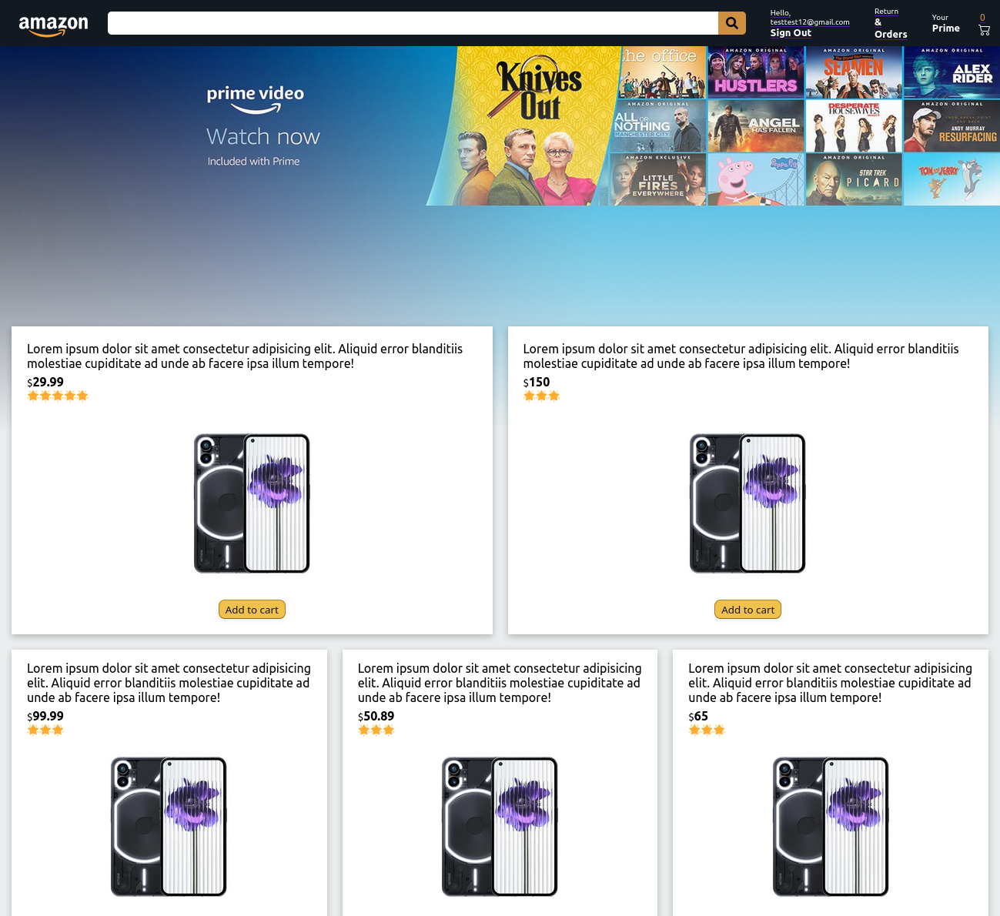
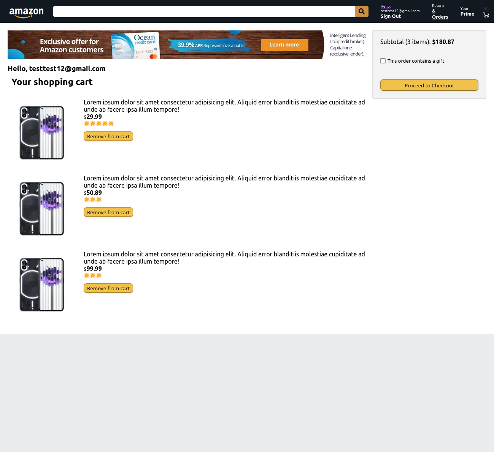
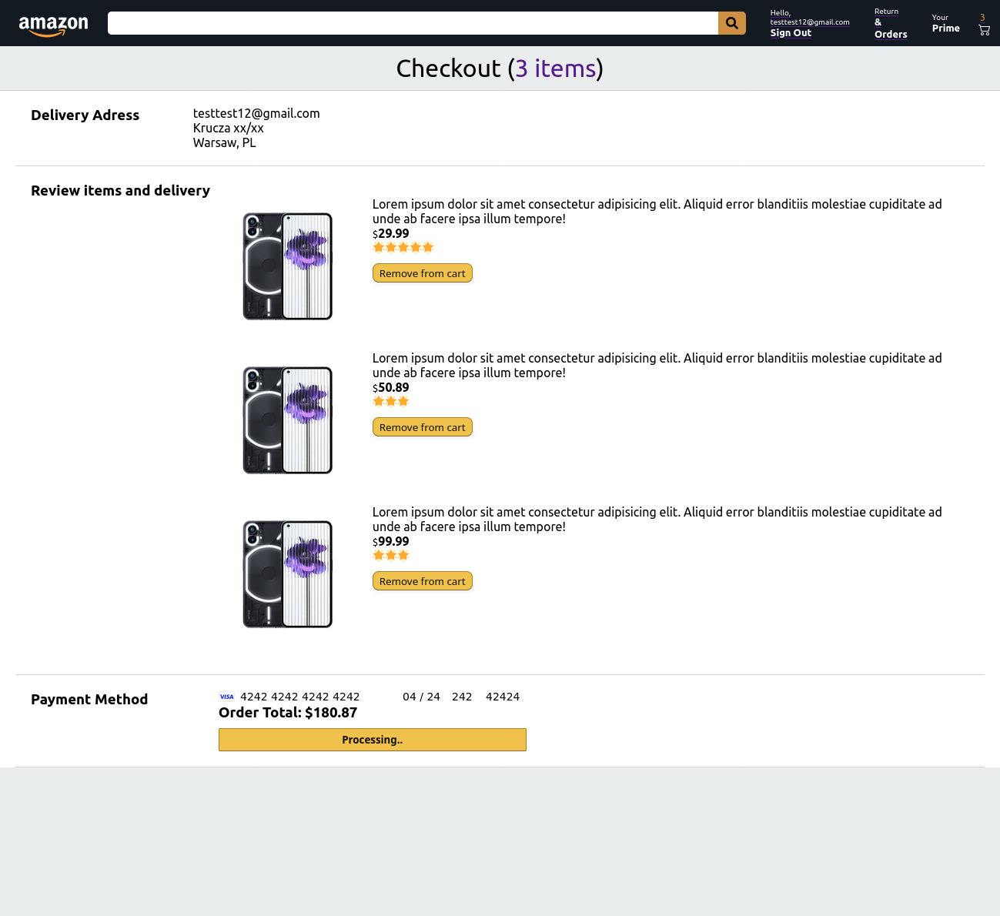

# Amazon Clone

Clone of world popular auctions service, functionality is limited to features.
Site is made only for practice purpose.

Important note:

- MVP version
- more incomming
- !!! Site is not real, there is no way to buy anything.!!!

## Technologies:

- HTML
- CSS (BEM convention)
- JS
- React
- React Icons
- React Router
- Firebase
- Moment.js
- Axios

## Live:

https://jc--clone-5b94a.web.app/

## Setup

To run this project, install it locally using npm:

```
$ cd ../jc-amazon-clone
$ npm install
$ npm start
```

## Features:

- [Logging in/Signing In](#Logging-In)
- [Logginig off/Main page](#Main-Page)
- [Cart](#Cart)
- [Payments](#Payments)
- [Orders History](#Orders-History)

### Logging In

Log in or sign in via logging page.


### Main Page

Possibility to add products to cart and log off(right to search bar).



### Cart

Possibility to check contents of a cart, remove item, subtotal price and proceed to checkout page.



### Payments

Possibility to remove item and finalize payment.
To pass through payment fill VISA input field as image shown.



### Orders History

Only for logged people possibility to check orders history, id of order, date and purchased items.


